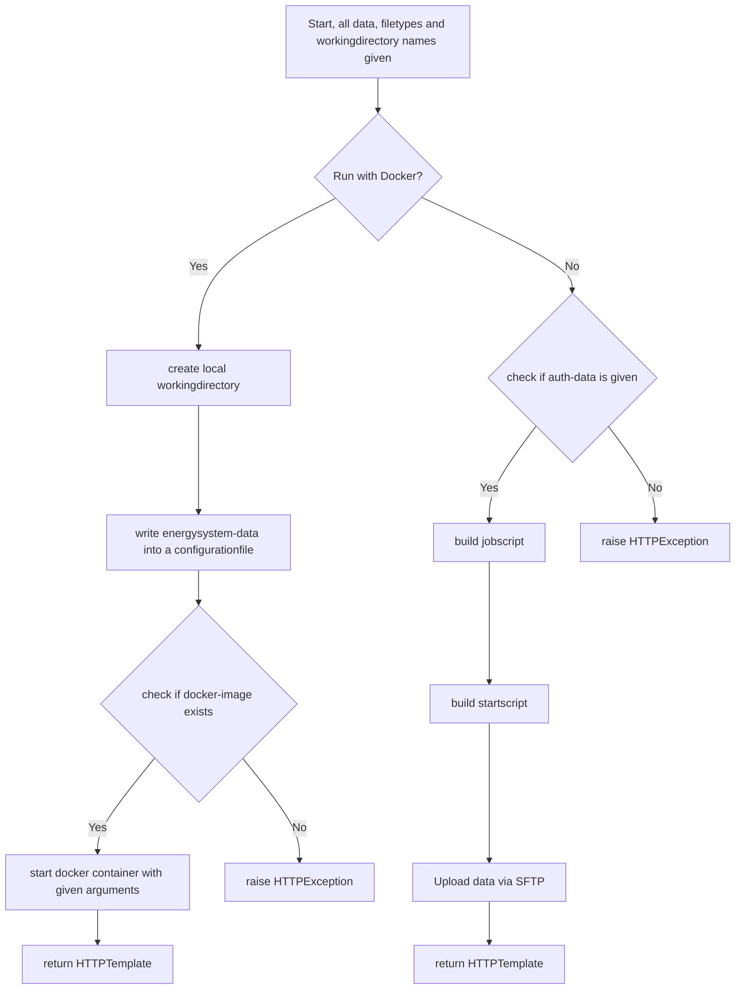

# Functions

## Public Functions

### URL: "/"
Generic root-path to render the mainpage.
To get an overview of the rendered page see the picture below.

<figure markdown>
  
  <figcaption>Example-GUI for the given API</figcaption>
</figure>

### URL: "/uploadFile"
This path is used by websites which provide a graphical user interface, like the root path of these API.

The python function reads all provided datafiles in and runs the simulations depending on the flag 'docker' which is a radio box on the given gui. (See the picture above.)
Listed below is the a code example for the graphical user interface above.

```html linenums="1"
<div class="row">
  <div>
    <h1>Upload verschiedener Dateiformate</h1>
    <form action="/uploadFile" enctype="multipart/form-data" method="post">
      <h5>Daten des Energiesystems</h5>
      <div class="mb-3">
        <label for="datafile" class="form-label">Konfigurationsdatei</label>
        <input class="form-control" name="datafiles" type="file" id="datafile" multiple="multiple"><br />
        <div onchange=toggle\_login\_form()>
          <h5>Ausführungsmethode</h5>
          <div class="form-check">
            <label class="form-check-label" for="docker">Run with Docker</label>
            <input class="form-check-input" type="radio" name="docker" id="docker" value="docker" checked>
          </div>
          <div class="form-check">
            <label class="form-check-label" for="ssh">Run with SSH</label>
            <input class="form-check-input" type="radio" name="docker" id="ssh" value="ssh"> 
          </div><br/>
          <div class="mb-3 row" id="loginform" hidden>
            <h5>Logindaten Universitätsrechenzentrum</h5>
            <div   class="col">
              <label for="username" class="form-label">Username</label>
              <input type="username" class="form-control" name="username" id="username" placeholder="Nutzername">
            </div>
            <div class="col">
              <label for="password" class="form-label">Email address</label>
              <input type="password" class="form-control" name="password" id="password" placeholder="Password">
            </div>
          </div>
        </div><br />
        <button class="btn btn-outline-success form-control" type="submit">Run Simulation</button>
      </div>
    </form>
  </div>
</div>
```
!!! note
    The submitted file can be a generated binary or json file. Therefore the binary file must be in binary-encoding and the JSON-file as regular utf-8 encoded file.

### URL: "/uploadJson"
This path is used the send post-requests where the energysystem is an json-formatted string as data of the request.

The python function wraps all given data to the private function 'run_simulation(..)' and returns the generated website with a list of foldernames, which are the current working directories or a HTTPException.
All created folders and their names are returned as a Jinja2-Template which is based on the template from the generic path.

!!! Note
    Every request create one workingdirectory for an energysystem. 
    It is not possible to submit more than one energysystem within one request.

## Private Functions

### generate_random_folder()
```python
import uuid

def generate_random_folder():
    return str(uuid.uuid4().hex)
```
This is a simple helper function to generate an uuid in hex to name and later create folders as workingdirectory.
uuid is used to guarantee a unique name.

### run_simulation(..)

#### Overview
The function 'run_simulation' creates all needed workingdirectories - locally or external, creates the given docker-containers with all arguments to run or upload the data to the UniRZ and create a startscript for the user to start solving all submitted energysystems at once.

!!! note
    UniRZ = Universitätsrechenzentrum Ilmenau

#### Deep Dive
From the functions above ("uploadFile" and "uploadJson") given data are tuples. 
These tuples contains the filedata and the filetype.

To create Containers or upload all data it is necessary to loop through these inputdata.

```python
for datafile, ftype in input:
    ...
```

At this point the algorithm has two variables, a datafile and the filetype of these datafile.
The not given path or name for the working directory is now created by the function "generate_random_folder" from above.

The graph below shows the following steps of the code.



If the Data is written to the UniRZ the user must start the given script by his own at the UniRZ. This is possible with the job submissions commands which are documented at this [Website](https://tu-ilmenau.de/hpc).

