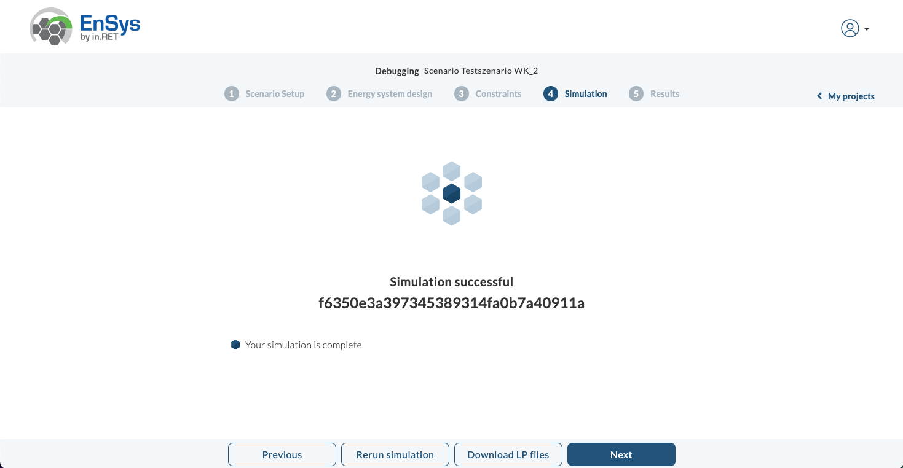
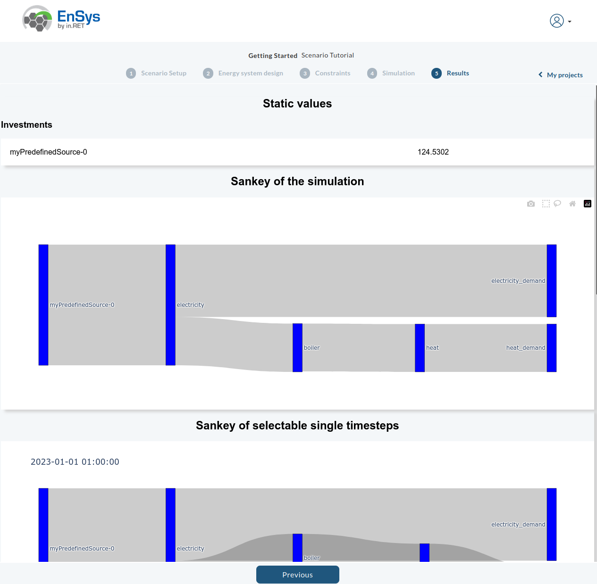

!!! warning
    This is a prototype. Under Construction!

## Start
After you visit the website the following page appears. This is our start.
<figure markdown>
  
</figure>

## Registration
Start the registration click the blue "Sign Up"-Button at the top right corner and fill in the following information: your name, email address, username and password. Finally, do not forget to read and accept the privacy statement. You should receive an email with a link to confirm the account creation.
<figure markdown>
  { width="250" }
</figure>
After the sign up you will recieve a activation-mail with further information to activate your account.
If the activation is done you can log in and see the following dashboard.

## Dashboard
<figure markdown>
  { align=right }
</figure>

As new user you doesn't find any project and scenarios. How you create and simulate is part of the next step.

The dashboard shows a navigation bar on top. On the right you can find a list of links and the dropdown menu for managing your account. On the left is the logo from "EnSys" which is also the homebutton.

On the bottom menubar you can find various links to information about the developer, our github repository, use cases which you can use to create scenarios, a short FAQ and legal notices like the imprint, privacy and license of the software.

## Create Project, Scenario, Energysystemmodell and Simulate

=== "Create Project"

    !!! warning
        Under Construction

    === "Create Project Menu"
        <figure markdown>
            
        </figure>

    === "Create Project Form"
        <figure markdown>
            
        </figure>

=== "Create Scenario"

    !!! warning
        Under Construction

    <figure markdown>
      
    </figure>

=== "Modelling the Energysystem"

    !!! warning
        Under Construction

    === "Before Modelling"
        <figure markdown>
            
        </figure>
    
    === "After Modelling"
        <figure markdown>
            
        </figure>
    

=== "Set the constraints"

    !!! warning
        Under Construction

    <figure markdown>
      
    </figure>

=== "Start the Simulation"

    !!! warning
        Under Construction

    === "Before Simulation"
        <figure markdown>
            
        </figure>
    
    === "After Simulation"
        <figure markdown>
            
        </figure>

=== "Show the results"

    !!! warning
        Under Construction

    <figure markdown>
      
    </figure>
